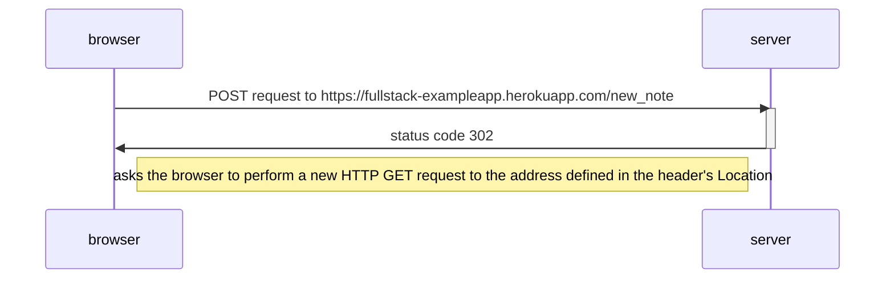

```mermaid
sequenceDiagram
  participant browser
  participant server

  browser->>server: POST request to https://fullstack-exampleapp.herokuapp.com/new_note
  activate server
  server->>browser: status code 302
  deactivate server
  Note left of server: asks the browser to perform a new HTTP GET request to the address defined in the header's Location

```
